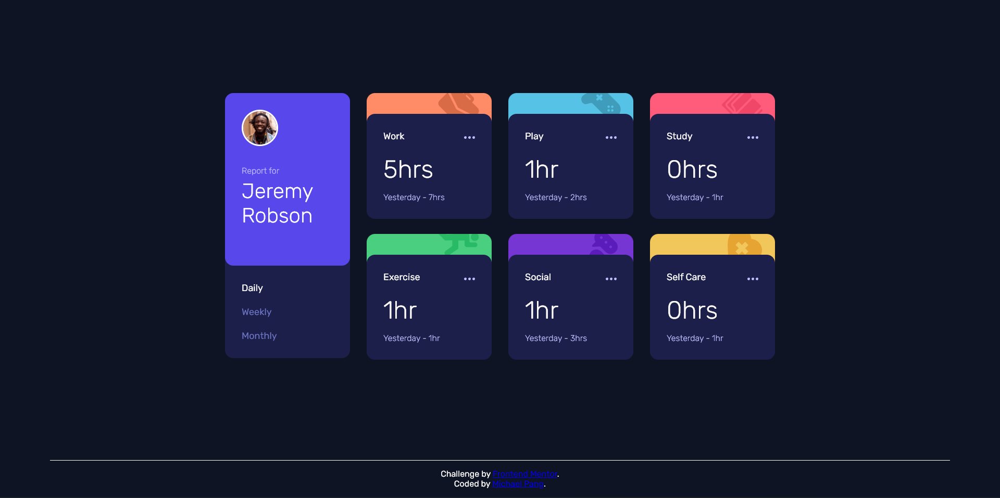

# Frontend Mentor - Time tracking dashboard solution

This is a solution to the [Time tracking dashboard challenge on Frontend Mentor](https://www.frontendmentor.io/challenges/time-tracking-dashboard-UIQ7167Jw). Frontend Mentor challenges help you improve your coding skills by building realistic projects. 

## Table of contents

- [Frontend Mentor - Time tracking dashboard solution](#frontend-mentor---time-tracking-dashboard-solution)
  - [Table of contents](#table-of-contents)
  - [Overview](#overview)
    - [The challenge](#the-challenge)
    - [Screenshot](#screenshot)
    - [Links](#links)
  - [My process](#my-process)
    - [Built with](#built-with)
    - [What I learned](#what-i-learned)
    - [Continued development](#continued-development)
  - [Author](#author)

## Overview

### The challenge

Users should be able to:

- View the optimal layout for the site depending on their device's screen size
- See hover states for all interactive elements on the page
- Switch between viewing Daily, Weekly, and Monthly stats

### Screenshot



### Links

- Solution URL: [https://github.com/pangm1/FrontEndMentor-Time-Tracking-Dashboard_pangm1](https://github.com/pangm1/FrontEndMentor-Time-Tracking-Dashboard_pangm1)
- Live Site URL: [https://front-end-mentor-time-tracking-dash.vercel.app/](https://front-end-mentor-time-tracking-dash.vercel.app/)

## My process

### Built with

- Semantic HTML5 markup
- CSS custom properties
- Flexbox
- CSS Grid
- Mobile-first workflow
- AJAX with JSON

### What I learned

For the HTML, I used a custom attribute (```timeframe```) to see which timeframe is supposed to being displayed.
For the CSS, I used the ```timeframe``` attribute to show and hide the elements holding the respective daily, weekly, and monthly data. This also includes the which button in the navigation is being highlighted and how the other ones light up on active states.

This way, I only have to change the ```timeframe``` attribute in the dashboard in the javascript to show the daily, weekly, or monthly dashboard.

I also used ```:has()``` so that the section isn't being highlighted when hovering over the _ellipsis_. If the section being hovered over also has the ellipsis being hovered over, set it back to its original color.

I also used AJAX and JSON to populate the dashboard with the data in the JSON file, and also added logic if it failed to read the file.

### Continued development

My HTML, CSS, and Javscript got considerably more complicated than previous projects. I wish to get better coding habits so I can manage this.
For HTML, I having a hard time organizing and categorizing element. For the CSS, I'm getting carried away with nesting rules, which complicates media queries. And for Javascript, I'm not too familiar with asynchronous programming.
I also wish to make a better experience for people using screen readers. I have briefly used [Silktide Accessibility Checker](https://chromewebstore.google.com/detail/silktide-accessibility-ch/mpobacholfblmnpnfbiomjkecoojakah?hl=en-GB&authuser=0), but I'm not sure if this is the a good way to check this.

## Author

- Frontend Mentor - [@pangm1](https://www.frontendmentor.io/profile/pangm1)